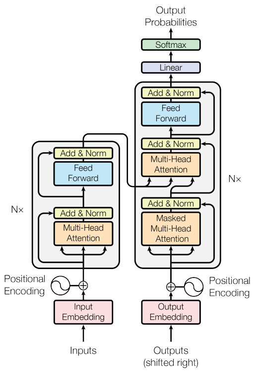
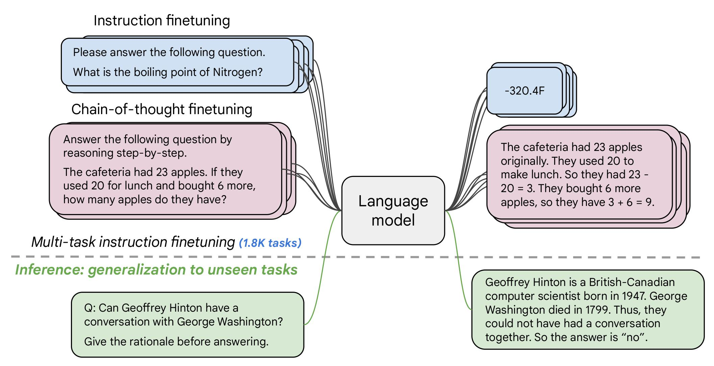
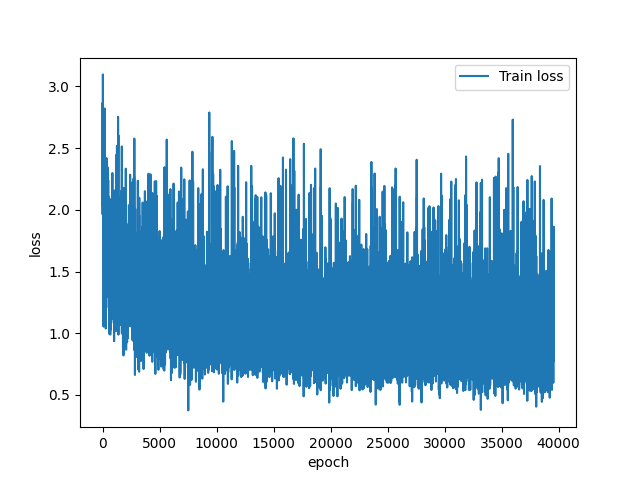
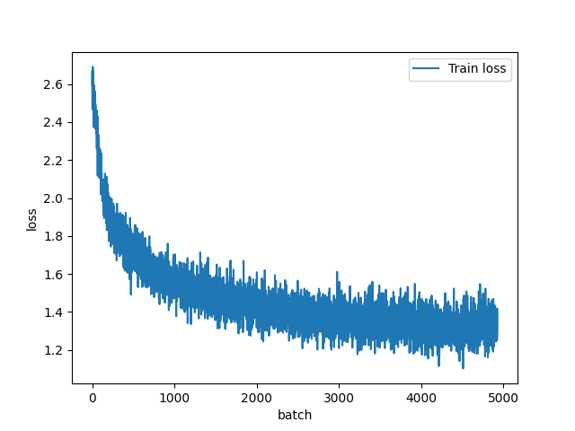
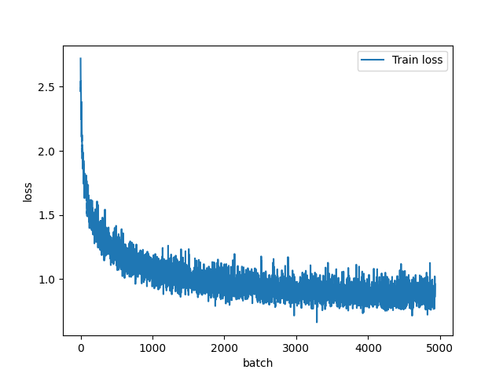

# Fine-Tuning Flan-T5 for Layman Summarisation

> Author: Yufan Pan  
> ID: 4885380

## Table of Contents
- [Fine-Tuning Flan-T5 for Layman Summarisation](#fine-tuning-flan-t5-for-layman-summarisation)
  - [Table of Contents](#table-of-contents)
  - [Introduction](#introduction)
  - [Dataset](#dataset)
  - [Project Goals](#project-goals)
  - [File Structure](#file-structure)
  - [Model Architecture](#model-architecture)
    - [T5 (Original Model)](#t5-original-model)
      - [Encoding](#encoding)
      - [Decoding](#decoding)
    - [Flan-T5](#flan-t5)
  - [Data Augmentation](#data-augmentation)
  - [Training and Reproducing Results](#training-and-reproducing-results)
    - [Hardware Requirements](#hardware-requirements)
    - [Parameters](#parameters)
  - [Training Runs](#training-runs)
    - [Test Run 1](#test-run-1)
    - [Test Run 2](#test-run-2)
  - [Results](#results)
  - [Training Loss](#training-loss)
  - [Model Benchmarking](#model-benchmarking)
    - [Rouge](#rouge)
    - [Perplexity](#perplexity)
    - [Benchmark Examples and Explanation](#benchmark-examples-and-explanation)
      - [Example 1](#example-1)
      - [Example 2](#example-2)
      - [Example 3](#example-3)
      - [Example 4](#example-4)
      - [Example 5](#example-5)
    - [Analysis](#analysis)
    - [Training/Inference Instructions](#traininginference-instructions)
    - [Dependencies](#dependencies)
  - [Future Improvements](#future-improvements)
  - [References](#references)

## Introduction
The Flan-T5 Model is an open-source large language model published by Google Researchers. Derived from the encoder-decoder T5 (Text-to-Text Transfer Transformer), Flan-T5 is fine tuned and optimised to comprehend a broad range of natural language processing instructions. Flan-T5 is flexible and can be further fine tuned to achieve a desired Language Processing Task. 

## Dataset
Biomedical publications often contains the latest research in preventing and treating prominent health-related issues. These publications are of great importance for a wide range of audiences, whether they are medical professionals or members of the public. The BioLaySumm dataset focuses on summarising complex biomedical articles, with an emphasis on catering for non-expert readers.  
The dataset used is BioLaySumm Subtask 2.1 - Radiology Report Translation. It is comprised of radiology and layman reports from four datasets (PadChest, BIMCV-COVID 19 GitHub, Open-i and MIMIC-CXR). These datasets make up the model training and evaluation splits. 

Fine-tuning the model will be performed on a held-out training split (~150,000 rows). The `train` split will be further split into a 70/30 configuration (70% used for training, 30% used for evaluation).  
As for prediction and model benchmarking, a random sample of 5 unseen rows will be chosen from the `validation` split (~10,000 rows).

## Project Goals
This project aims to fine-tune a pre-trained Flan-T5 model to accurately summarise technical radiology reports in the BioLaySumm dataset. After training, this model will be able to translate complex medical terms into simpler summaries. The accuracy of these summaries will be evaluated using the `Rouge` and `Perplexity` metrics. 

## File Structure
- `constants.py` - File containing training and LoRA parameters, dataset links and other model specific settings. 
- `dataset.py` - Contains the class used to load and preprocess the data.
- `modules.py` - This file builds and creates the model and optimisers
- `predict.py` - Usage of the fine-tuned model on unseen data. 
- `train.py` - Training and evaluation loop of fine tuning the project.

`train.py` is adapted from PyTorch training loop tutorial found [here](https://docs.pytorch.org/tutorials/beginner/introyt/trainingyt.html) and the HuggingFace tutorial [here](https://huggingface.co/learn/llm-course/en/chapter3/4).

## Model Architecture
### T5 (Original Model)

Introduced by Google in 2019, the T5 model was a significant milestone in Natural Language Processing (NLP). The T5 model revolutionised how NLP tasks could be completed. By converting all tasks (translation, summarisation, classification, etc) into a "text-to-text" framework, T5 allows for flexible and consistent problem solving approaches.  
This is achieved by adding prompts (or "prefixes") to the input text.
- For translation, the input may look like `translate this English text into German: [input sentence]`
- Summarising would be `summarise the following text: [input text]`. 

As a result of uniform NLP strategies, the T5 model is able to transfer its learning across a range of different tasks. By first training on a massive dataset then fine-tuning into specific NLP areas, T5 is able to achieve improved performance and efficiency.  
The specific dataset used for training was the *Colossal Clean Crawled Corpus* (C4). Using `Common Crawl`, a monthly snapshot of the entire internet was pulled and used as training data. The C4 dataset was cleaned with the following heuristics:
- Only contains lines ending in a terminal punctuation mark.
- Discarded pages with less than 3 sentences. Sentences must contain at least 5 words.
- Removed any page with any inappropriate words ([list of words](https://github.com/LDNOOBW/List-of-Dirty-Naughty-Obscene-and-Otherwise-Bad-Words))
- Cleaned of all `javascript`, `lorem ipsum` and other non-text sentences or pages.
- Deleted all duplicates.


Being a transformer-based encoder-decoder, the T5 architecture follows closely to the original transformer proposal in *Attention is All you Need* ([Vaswani et al., 2017](https://proceedings.neurips.cc/paper_files/paper/2017/file/3f5ee243547dee91fbd053c1c4a845aa-Paper.pdf)).


<figure align="center">
    
    <figcaption>Figure 1: Transformer Architecture</figcaption>
</figure>

#### Encoding
Firstly, the input sequence is broken down into a series of tokens. In this scenario, the tokens would be the individual words of the prompt or radiology report to summarise. Afterwards, the token sequence is transformed into a vector, which contains semantic information represented by numbers.  
Positional encoding adds information indicating each token's respective position in the sequence. This allows the model to maintain the order of the input.  

Transformers contains `N` layers of transformer blocks. Each layer contains two subcomponents: a multi-head self-attention mechanism followed being a simple feed-forward network. Between these components are layer normalisation operations.  

Multi-head self-attention allows the model to view different parts of the sequence at once, and mapping each to a weighted average representing the importance. These average values are compared to against the entire sequence.  
The T5 transformer uses a simplified Layer Normalisation, where activations are only rescaled (bias are not applied). T5 also applies a skip connection transferring each subcomponent's input to the output. This helps mitigate the vanishing gradient problem.  
Finally, each layer of the encoder and decoder contains a fully connected feed-forward network. It consists of two linear transformations with a ReLU activation in between.  
Dropout is applied throughout the entire process (feed-forward network, skip connection, attention weights and input/output of the full stack) to reduce overfitting.  

#### Decoding
The decoder is similar in structure with the addition of a third subsection - a standard attention mechanism. It uses a form of causal self-attention, which restricts the model to attend to past outputs of the encoder stack. This enables the decoder to access useful information about the input sequence to generate a relevant output.  
The final decoder's output is fed into a linear block and a softmax function. The linear layer performs a direct mapping from the vector space to the input domain. The output is a set of scores for each possible prediction token. Afterwards, the softmax function normalises the scores and generates a probability for each.

### Flan-T5 
Flan (Fine-tuned LAnguage Net) -T5 is an *instruction-tuned* version of the T5 model, with the main endgoal of enhancing the model's ability to perform zero-shot or few-shot prompting.  

<figure align="center">
    
    <figcaption>Figure 2: Flan-T5 instruction fine-tuning.</figcaption>
</figure>

The process involved taking a pre-trained T5 model, which is fine-tuned on a massive set of various Natural Language Processing Tasks, such as "Translate this sentence to German", or "Classify this movie review as positive or negative". The goal of this tuning method is to teach the model how to generalise seen and *unseen* tasks. The model not only becomes proficient in solving the given NLP tasks, but also becomes good at "following instructions" in general. 

Instruction tuning significantly improves Flan-T5's usability and ability to perform zero-shot reasoning. On the other hand, the T5 model would require multiple task-specific fine-tuning operations to achieve the same result. 

Overall, the Flan-T5 model enhances T5's existing text-to-text architecture by layering a broad understanding of following human instructions, making it more versatile and capable without additional tuning.

## Data Augmentation
When fine tuning in the training loop, rather than only having 1 prompt (prefix), a random prefix is chosen from a list of 4 similar prompts. This gives the model a broader understanding of different zero-shot prompts, increasing its flexibility in a real-world scenario. 
No other augmentation method is used due to the sensitivity of medical terminology in the radiology reports. For example, words "lesion" and "spot" may change the intended meaning of the report, resulting in unwanted behaviour. 

Below is taken from [`dataset.py`](./dataset.py)
``` Python
class FlanDataset(Dataset):
    def __init__(self, dataframe: pd.DataFrame, tokenizer) -> None:
        self.tokenizer = tokenizer
        # self.prefix = MODEL_PROMPT
        self._prompts = [
            "Translate this radiology report into a summary for a layperson: ",
            "Summarise the following medical report in simple, easy-to-understand terms: ",
            "Explain this radiology report to a patient with no medical background: ",
            "Provide a layperson's summary for this report: "
        ]

    ...

    def __getitem__(self, index: int) -> list:
        row = self.dataframe.iloc[index]

        rand_prefix = random.choice(self._prompts) # Random Prefix selection
        report = rand_prefix + str(row[INPUT_COLUMN])
        summary = str(row[TARGET_COLUMN])

    ...    
```

## Training and Reproducing Results
### Hardware Requirements
| Hardware | Description |
| -------- | ----------- |
| CPU      | 8x vCPU cores (AMD Zen 2) |
| GPU Type | NVDIA A100 |
| VRAM     | 40 GB |
| RAM      | 64 GB |

### Parameters
| Parameter | Description |
| --------- | ----------- |
| Model     | `google/flan-t5-base`   |
| Parameter count | Base Model: ~250M, Trainable: ~3.5M (1.4093%) |
| Fine-Tuning Strategy | LoRA (see below) |
| Epochs    |      3       |
| Learning Rate |    3e-4      |
| Training Time (epoch) | ~30 minutes |
| Training Time (total) | ~1 hour 30 minutes |


| LoRA Setting | Value |
| ----------- | -------|
| `r` | 64 |
| `lora_alpha` | 128 |
| `lora_dropout` | 0.05 |
| `target_modules` | `["q", "v"]` |


## Training Runs

### Test Run 1
For the first initial test run, there were several parameter issues when fine-tuning. The learning rate was standard (`1e-4`), accompanied with a small batch size (`8`) and low LoRA rank (`8`). This configuration resulted in a tedious 10+ hours of training for 3 epochs, and lower `Rouge` scores by the end of training.  
`
rouge1: 61.4408
rouge2: 38.9073
rougeL: 55.1041
rougeLsum: 55.1024
`

<figure align="center">
    
    <figcaption>Figure 3: First test run loss plot.</figcaption>
</figure>

> Note: `x` axis 'epoch' is a typo, it should be 'batch'

The combination of a small batch size resulted in unstable and noisy gradient updates, which is indicated by plotting the loss. With only 8 examples per step, the gradient varies greatly. This stopped the model from converging to an optimal solution, as shown above. As for the `rouge` scores, the low `LoRA` rank prevented the model from extracting features from more complex summarisation tasks.

### Test Run 2
Based on the first run to test training functionality, the second run aimed to stabilise the training process. The batch size was increased to `64`, and the learning rate is reduced to `5e-5` to identify any improvements. Furthermore, the model's `LoRA` rank was increased to 16.  
Furthermore, the `input` and `output` tokens had to be decreased. The new values are 128 and 256 respectively. The original 512 and 1024 tokens caused an Out of Memory error even on the NVDIA `a100` hardware.  
While the `rouge` scores were better compared to [Test Run 1](#test-run-1), the improvement was not great.  
`
rouge1: 65.2291
rouge2: 43.3993
rougeL: 59.1551
rougeLsum: 59.1569
`

<figure align="center">
    
    <figcaption>Figure 4: Second test run loss plot.</figcaption>
</figure>

Increasing the batch size successfully stabilised the loss during training. However, the learning rate decrease was unnecessary, as the model adjusted parameters too cautiously. As a result, the model could not effectively traverse the loss function, which inhibited convergence. Although the `LoRA` rank was doubled to 16, the combination of the previous parameters rendered this change uneffective.

## Results
From [Test Run 2](#test-run-2), the key insight was to increase the learning rate. The batch size was kept the same as the loss was much more stable, and the `LoRA` rank was upscaled to `32`, allowing the model to capitalise on the learning rate (as well as to make the most of the `a100` hardware).  
After tuning the training parameters, the final `Rouge` output of the model is as follows:  
| Rouge`x` | Value |
| -------- | ----- |
| Rouge`1` | 71.1907 |
| Rouge`2` | 51.8309 |
| Rouge`L` | 65.8092 |
| Rouge`Lsum` | 65.8156 |

## Training Loss

<figure align="center">
    
    <figcaption>Figure 5: Resulting run loss plot.</figcaption>
</figure>

This loss plot highlights the synergy between a high learning rate and batch size. The graph clearly indicates a steeper negative gradient for the first 500 batches, as well as converging slightly earlier due to the larger learning rate. As a result, the loss has fully stabilised before epoch 3 started (~3200 on the `x` axis).
The increased `LoRA` rank enabled the model to learn more complex patterns in the data.  

## Model Benchmarking
The fine-tuned model was benchmarked using the `validation` section of the dataset. As all training occurred in the `train` split, the model has never seen the radiology reports from this section. 

### Rouge
`Rouge` (Recall-Oriented Understudy for Gisting Evaluation) is a set of metrics used to evaluate summarisation in Natural Language Processing. It is used against a reference of the "expected" summary.
All types of `rouge` scores are calculated based on three metrics:
- Recall: How many words from the reference summary are present in the model's prediction?
- Precision: How many words in the model's prediction were relevant?
- F1-Score: Harmonic mean of both Recall and Precision. 

`rouge1`: this metric counts how many individual words appear in both the generated and reference summaries. No order is required. `rouge1` is mainly used to identify if the model has captured the key points in the radiology report.

`rouge2`: this metric is similar to `rouge1`, except it measures pairs of words. Order within the pair must be identical. `rouge2` is used to check for fluency and grammatical correctness. More matching pairs likely correlate to coherent output. 

`rougeL` measures the longest matching sequence of words that is shared between the generated and reference summaries (whole text). These words must be in the same order, but do not need to be consecutive. `rougeL` gives the model leniency when it comes to rephrasing, and can identify sentence-level similarity. `rougeL` is often the most critical metric. 

`rougeLsum` is structurally similar to `rougeL`. `rougeLsum` computes the longest matching sequence for each individual sentence (if applicable) rather than the entire text. This metric is normally identical to `rougeL` except when the input contains several sentences. 

### Perplexity
`Perplexity` is not required for analysing the model's output, but it is an interesting benchmarking tool. `Perplexity` seeks to quantify the "uncertainty" a model experiences when predicting the next token in a sequence [(Morgan, 2024)](https://www.comet.com/site/blog/perplexity-for-llm-evaluation/). Higher values means the model is uncertain about which word to pick next, indicating low training coverage of the specific task. 

This metric is particularly relevant in the context of the `BioLaySumm` dataset. Due to the sensitivity of medical reports, an overconfident wrong answer could result in serious consequences. This metric will provide further insight into the shortcomings of the current fine-tuning method.

### Benchmark Examples and Explanation

#### Example 1
`validation` split - row 10  

`radiology_report`: "Within normal limits"  

`layman_report`: "Everything looks normal"  

`model_prediction`: "Everything looks normal"  

| `rouge` | Score |
| ------- | ----- |
| `rouge1` | 100.0000 |
| `rouge2` | 100.0000 |
| `rougeL` | 100.0000 |
| `rougeLsum` | 100.0000 |  

Given a very simple radiology report, the model is able to accurately summarise it into simpler terms. The model does not attempt to overcomplicate the summary, and stops when required.

| `Perplexity` | Score |
| ------- | ----- |
| `fine-tuned-model` | 1.0156 |
| `base-model` | 43.2500 |

#### Example 2

`validation` split: row 9905  

`radiology_report`: "The technique is compared with a previous X-ray from October 8, 2020. A questionable peribronchovascular opacity is noted in the left mid lung field. Slight blunting of both costophrenic angles, likely chronic in nature. Elongation of the descending thoracic aorta. Signs of diffuse osteopenia."

`layman_report`: "I compared the imaging technique with a previous X-ray from October 8, 2020. There's a possible cloudiness around the airways in the middle of the left lung. Both sides of the chest where the ribs meet the diaphragm are slightly rounded, probably from a long-term condition. The large blood vessel in the chest is elongated. There are signs of reduced bone density throughout the body."

`model_prediction`: "The X-ray was compared to a previous one from October 8, 2020. There might be a possible cloudiness around the airways in the middle of the left lung. The angles where the lungs meet the diaphragm are slightly less sharp, probably because of a long-term issue. The main blood vessel coming out of the chest is elongated. There are signs of widespread osteopenia."

| `rouge` | Score |
| ------- | ----- |
| `rouge1` | 72.1805 |
| `rouge2` | 51.9084 |
| `rougeL` | 66.1654 |
| `rougeLsum` | 66.1654 |  

This example contained more colloquial phrases compared to other radiology reports. 

| `Perplexity` | Score |
| ------- | ----- |
| `fine-tuned-model` | 1.9453 |
| `base-model` | 9.1875 |


#### Example 3
`validation` split - row 6773  

`radiology_report`: "Tracheostomy cannula in place. Central venous catheter inserted through the right subclavian vein into the superior vena cava. Bilateral interstitial and alveolar infiltrates, predominantly at the hilar and bibasal levels, associated with pleural effusion."  

`layman_report`: "A breathing tube is in place. A central vein catheter is inserted through the right shoulder vein into the large vein near the heart. There are signs of fluid and inflammation in both lungs, mainly at the lower parts and near the windpipe, with fluid around the lungs.
"

`model_prediction`: "A tube is in place for breathing. A central vein catheter is inserted through the right collarbone vein into the large vein near the heart. There are signs of fluid in both lungs, mainly at the top and lower parts, along with fluid around the lungs."  

| `rouge` | Score |
| ------- | ----- |
| `rouge1` | 89.3617 |
| `rouge2` | 71.7391 |
| `rougeL` | 85.1064 |
| `rougeLsum` | 85.1064 |  

As for this case, the radiology report is short, but is almost fully comprised of technical terms. There are little casual phrasing or "everyday" terms. Despite this, the model is able to predict with a high 85 `rougeL` score. This indicates the model has correctly learnt how to summarise medical jargon into layperson terms, whilst maintaining fluency and coherence. On the other hand, the `rouge1/2` scores are also very high, showing that key summarisation information has stayed intact.  

However, a key error with the model's prediction is how it interpreted "hilar and bibasal levels". The official meaning of bibasal is lower parts, and hilar means near the windpipes. As a result, this shows the minor issues with `rouge`, and highlights the importance of manual review.

| `Perplexity` | Score |
| ------- | ----- |
| `fine-tuned-model` | 1.7188 |
| `base-model` | 15.1875 |

#### Example 4

`validation` split - row 1640  

`radiology_report`: "A study with oral and intravenous contrast was performed in arterial and venous phases. In the chest, there is a significant increase in the consolidation in the right posterior inferior segment, which has grown from 20x15mm to 42x25mm. It shows a pseudotriangular morphology with a central cystic area and isolated punctate calcifications, delimited by vessels and dense linear tracts in contact with the pleura. Peripheral to the lesion, pseudonodular infiltrates with diffuse contours are observed, larger in size with dilated bronchi within. No mediastinal or hilar adenopathies are noted. Known bilateral elastofibromas dorsi. Hiatal hernia. In the abdomen and pelvis, no new hepatic nodules suspicious for metastasis are observed. Subcentimetric hypodense nodules similar to the reference study persist. The biliary tract, gallbladder, pancreas, and kidneys show no alterations. The uterus and bladder are preserved. The colon and small bowel loops are of normal caliber and distribution. Bone evaluation does not reveal suspicious focal lesions. Conclusion: The mass in the LID has significantly increased. Suspicion of a neoplastic process, either metastatic or primary. Consider performing bronchoscopy and/or PET-CT."  

`layman_report`: "A study was done using both oral and intravenous contrast during different phases. In the chest area, there is a noticeable growth in a particular area of the lung on the right side, which has increased in size from 20x15mm to 42x25mm. This area has a triangular shape with a central cystic part and some small calcified spots, surrounded by blood vessels and dense lines that are in contact with the lung lining. Around this area, there are pseudonodular infiltrates with unclear edges, larger in size with widened air passages within. There are no enlarged lymph nodes in the mediastinum or hilum. Known bilateral elastofibromas dorsi are present. A hiatal hernia is also noted. In the abdomen and pelvis, no new liver nodules that could indicate metastasis are observed. Small hypodense nodules similar to the previous study persist. The bile ducts, gallbladder, pancreas, and kidneys show no changes. The uterus and bladder are normal. The colon and small intestine loops are of normal size and distribution. Bone evaluation does not reveal any suspicious focal lesions. Conclusion: The mass in the lower lobe of the right lung has significantly increased. There is suspicion of a neoplastic process, either metastatic or primary. It is recommended to consider performing bronchoscopy and/or PET-CT."

`model_prediction`: "A study was done with contrast dye in the blood vessels and veins. In the chest, there's a big increase in the lung tissue in the right back part, which has grown from 20x15mm to 42x25mm. It has a pseudotriangular shape with a central cystic area and isolated punctate calcifications, delimited by vessels and dense linear tracts in contact with the pleura. Peripheral to the lesion, pseudonodular infiltrates with diffuse contours are observed, larger in size with dilated bronchi within. No mediastinal or hilar adenopathies are noted. Known bilateral elastofibromas dorsi. Hiatal hernia. In the abdomen and pelvis, no new hepatic nodules suspicious for metastasis are observed. Subcentimetric hypodense nodules similar to the reference study persist. The biliary tract, gallbladder, pancreas, and kidneys"  

| `rouge` | Score |
| ------- | ----- |
| `rouge1` | 54.9254 |
| `rouge2` | 30.6306 |
| `rougeL` | 45.3731 |
| `rougeLsum` | 45.3731 |  

In the Test Runs, the model's input and output tokens were severely decreased. This design decision's consequence is apparent for longer reports as shown here. It is evident that the long input was not fully summarised because of the abrupt ending and low `rouge` scores. Another aspect which is key to note is the very low `rouge2` score, which indicates less fluent summarisation. Overall, extremely long reports will be a critical point for future improvement. 

| `Perplexity` | Score |
| ------- | ----- |
| `fine-tuned-model` | 2.7812 |
| `base-model` | 4.7812 |


#### Example 5

`validation` split - row 206

`radiology_report`: "The cardiomediastinal silhouette is normal size and configuration. Pulmonary vasculature within normal limits. There is right middle lobe airspace disease, may reflect atelectasis or pneumonia. No pleural effusion. No pneumothorax. Elevated right hemidiaphragm. Right middle lobe airspace disease may reflect atelectasis or pneumonia. ."  

`layman_report`: "The heart and the area around it appear normal in size and shape. The blood vessels in the lungs are also normal. There is a problem with the lung tissue in the middle of the right lung, which could be due to the lung collapsing or an infection like pneumonia. There is no fluid around the lungs and no air outside the lungs. The right side of the diaphragm, the muscle that separates the chest from the abdomen, is higher than normal. The issue in the middle of the right lung could be due to the lung collapsing or pneumonia."  

`model_prediction`: "The heart and middle chest area look normal in size and shape. The blood vessels in the lungs are within the normal range. There is a condition called right middle lobe airspace disease, which could be due to lung collapse or pneumonia. There is no fluid around the lungs. There is no air outside the lungs. The right side of the diaphragm, which is the muscle that separates the chest from the abdomen, is raised. The right middle lobe airspace disease may be due to lung collapse or pneumonia."  

| `rouge` | Score |
| ------- | ----- |
| `rouge1` | 74.0741 |
| `rouge2` | 56.6845 |
| `rougeL` | 70.8995 |
| `rougeLsum` | 70.8995 |  

For a medium length and complexity 

| `Perplexity` | Score |
| ------- | ----- |
| `fine-tuned-model` | 1.6562 |
| `base-model` | 8.9375 |


### Analysis

Overall, the `rouge` scores provide strong quantitative evidence of the model's ability to summarise expert radiology reports into layperson terms. The high `rouge1` scores indicate excellent recall of key content and medical terms. Moreover, an average `rouge2` of above 50 suggests the model can summarise and arrange words into fluent and grammatically correct phrases. This is critical as to allow a wide range of audiences to read and comprehend the summary. The primary metric `rougeL` often scores above 70 for the average length report, confirming the model's ability to replicate sentence-level structure.  
When testing on individual samples, drops in `rouge` scores provided a clear signal for truncated or incorrect outputs. These samples are key for future improvement identification. 

Throughout all examples, the `perplexity` score is consistently between 2 - 4 times lower for the fine-tuned model. This strongly indicates the model is no longer suprised to see medical terminology, and is confident in knowing how to summarise radiology jargon. Additionally, it has adapted to the style of the `BioLaySumm` dataset.  
However, in [Example 4](#example-4), the gap between `perplexity` scores is extremely low. Due to the length of the input, the fine-tuned model has difficulty consistently predicting specifics (anatomical locations, sizes, shapes). Contrastingly, the base model had the best performance in all runs. Long, sophisticated medical documents as likely found in its huge pre-training dataset, improving its ability to predict outputs. 


### Training/Inference Instructions
**Basic Setup**
```
~$ git clone https://github.com/piradiusquared/PatternAnalysis-2025.git ./flan_setup && cd ./flan_setup
flan_setup$ git checkout 'topic-recognition'
flan_setup$ cd recognition/FLAN_s4885380

```

**Rangpur Steps**
```
~$ source miniconda/bin/activate
(base) ~$ conda activate [env_name]
(env_name) ~$ cd ./flan_setup/recognition/FLAN_s4885380
(env_name) FLAN_s4885380$ pip install -r requirements.txt
```

**Running Training**


**Running Benchmarking**

### Dependencies
The following libraries are required to reproduce the fine-tuning process (as of `31/10/2025`):
``` Bash
# Core Fine Tuning and NLP packages
accelerate==1.10.1
bitsandbytes==0.48.1
datasets==4.2.0
evaluate==0.4.6
peft==0.17.1
safetensors==0.6.2
tokenizers==0.22.1
torch==2.8.0
transformers==4.57.0

# Other Utilities
matplotlib==3.10.7
nltk==3.9.2
numpy==2.3.3
pandas=2.3.3
rouge-score==0.1.2
tqdm==4.67.1
```
Or, you may install through the provided ```requirements.txt``` file by running:
``` Bash
pip install -r requirements.txt
```

## Future Improvements
- Continue testing with the parameters to find ideal settings
- Increase input and output tokens (if hardware is suitable)
- Research into Data Augmentation for further model usability

## References

Biolaysumm.  
Available at: https://biolaysumm.org/ (Accessed: 24 October 2025).

(2022) Training with PyTorch - PyTorch Tutorials 2.9.0+cu128 documentation.  
Available at: https://docs.pytorch.org/tutorials/beginner/introyt/trainingyt.html (Accessed: 24 October 2025). 

A full training loop - Hugging Face.  
Available at: https://huggingface.co/learn/llm-course/en/chapter3/4 (Accessed: 24 October 2025). 

What are transformers? - transformers in Artificial Intelligence explained - AWS.  
Available at: https://aws.amazon.com/what-is/transformers-in-artificial-intelligence/ (Accessed: 29 October 2025). 

Vaswani, A. et al. (2023) Attention is all you need, arXiv.org.  
Available at: https://arxiv.org/abs/1706.03762 (Accessed: 29 October 2025). 

Raffel, C. et al. (2023) Exploring the limits of transfer learning with a unified text-to-text transformer, arXiv.org.  
Available at: https://arxiv.org/abs/1910.10683 (Accessed: 29 October 2025). 

Chung, H.W. et al. (2022b) Scaling instruction-finetuned language models, arXiv.org.  
Available at: https://arxiv.org/abs/2210.11416 (Accessed: 29 October 2025). 